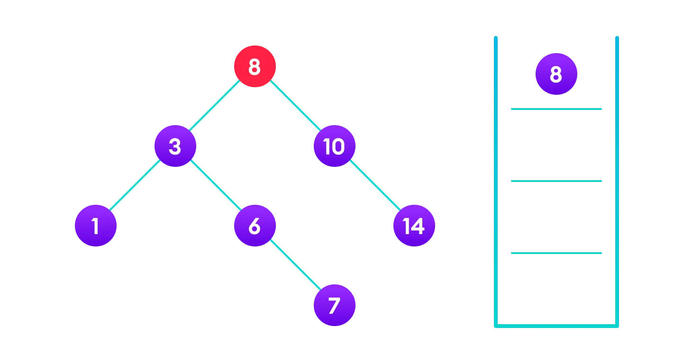
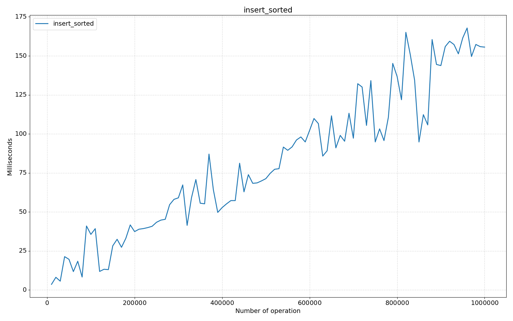
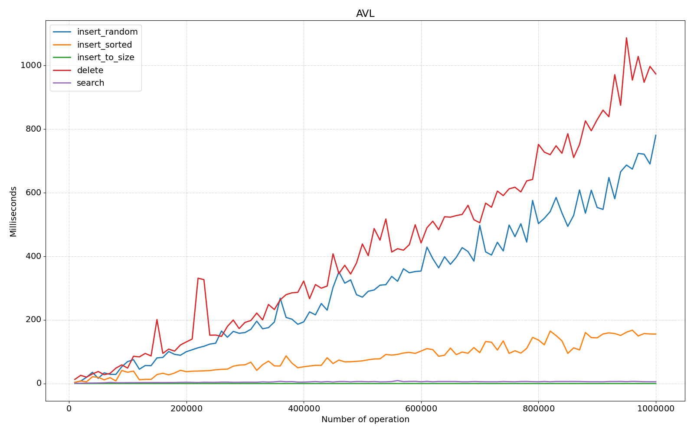
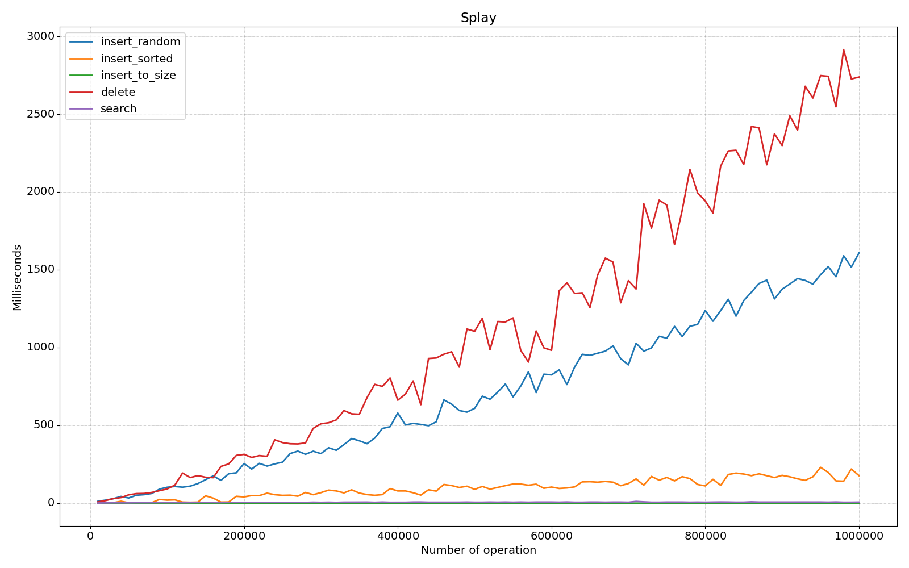
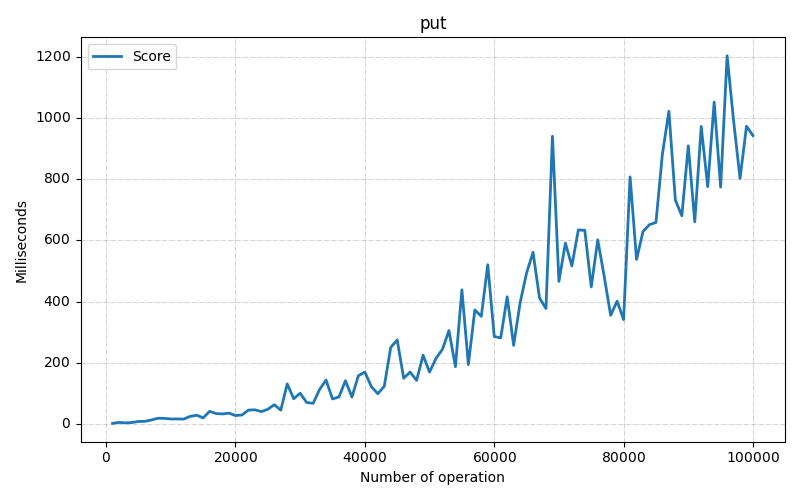
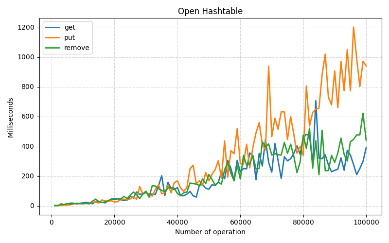
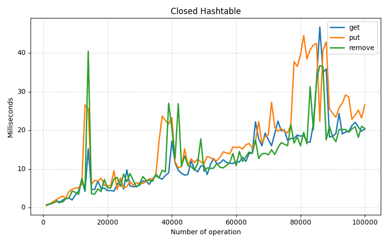

<style>
p, ul, li {
    font-size: 10pt;
    text-align: justify;
    line-height: 16pt;
}

td p {
    text-align: left;
}

pre {
    font-size: 8pt;
    margin: 0;
}

img {
    padding: 1pt;
}

hr {
    opacity: 0;
    page-break-after: always;
}

text {
    font-size: 8pt;
    line-height: 0;
}
</style>

<div style="display: flex; justify-content: space-between">

STU | FIIT

<p>27. 03. 2023.</p>
</div>
<br/><br/><br/><br/><br/>
<div style="height: 100%; width: 100%; display: grid; place-content: center; text-align: center">

## Data Structures and Algorithms

# Assignment 1 – Search in dynamic sets

### Artur Kozubov

#### Pondelok, 27. Marca 2023

</div>


---

# Content

1. Introduction
2. Binary search tree
    1. Theory
        1. Search operation
            1. Algorithm
        2. Insert operation
            1. Algorithm
        3. Delete operation
            1. Algorithm

3. Self-balancing binary search tree
    1. Theory
        1. Balance factor
        2. Rotating the subtrees
            1. Left Rotate
            2. Right Rotate

4. AVL tree
    1. Theory
        1. Rotation
        2. Rebalance
    2. Tests

5. Splay tree
    1. Theory
    2. Tests

6. Comparing binary search trees

7. HashTable
    1. Theory
        1. Hashing (Hash Function)
        2. Hash Collision
        3. Collision resolution
            1. Code
            2. Tests
        4. Open Addressing
            1. Code
            2. Tests

8. Comparing hashtable hash collision

---

# Introduction

In this assignment we needed to implement two binary search trees and two hash table variations.

I chose to implement the AVL and Splay trees because they are the most common and popular. For hash tables, there are
only two: with open addressing and with closed addressing.

For the best testing I decided to move away from the idea of testing with `Date.now()`, because it's silly and can lead
to incorrect results. Therefore, I decided to use [`jmh-core`](https://github.com/openjdk/jmh), since I chose to use
Java.

> ⚠️ In my implementation I tested up to one million, because for numbers higher than that - I got
> `java.lang.OutOfMemoryError: native memory extradition`. Since Ubuntu, on which my server was running, and on which I
> ran all the tests, had a one thread limit.

<div style="display: grid; grid-template-columns: repeat(2, minmax(0, 1fr)); gap: 24pt;">

⚒️ All the test were running on this processor (CPU): *Intel® Xeon® Platinum 8270 Processor*

<table>
<tr><td>Total Cores</td><td>26</td></tr>
<tr><td>Total Threads</td><td>52</td></tr
><tr><td>Max Turbo Frequency</td><td>4.00 GHz</td></tr>
<tr><td>Processor Base Frequency</td><td>2.70 GHz</td></tr>
<tr><td>Cache</td><td>35.75 MB</td></tr>
<tr><td>Max # of UPI Links</td><td>3</td></tr>
</table>
</div>


---

# Binary search tree

Binary search tree is a data structure that quickly allows us to maintain a sorted list of numbers.

- It is called a binary tree because each tree node has a maximum of two children.
- It is called a search tree because it can be used to search for the presence of a number in `O(log(n))` time.

The properties that separate a binary search tree from a regular binary tree is:

1. All nodes of left subtree are less than the root node.
2. All nodes of right subtree are more than the root node.
3. Both subtrees of each node are also BSTs i.e. they have the above two properties.

## Theory

### Search operation

The BST property that each left subtree has values below the root and each right subtree has values above the root is
what the method relies on.

If the value is above the root, we can be certain that it is not in the left subtree and only need to search in the
right subtree. Likewise, if the value is below the root, we can be certain that it is not in the right subtree and only
need to search in the left subtree.

#### Algorithm:

<table>
<tr>
<td colspan="4" style="padding: 0;">

[//]: # (@f:off)
```java
public Node search(int element) {
    Node node = root;
    while (node != null && node.value != null && node.value != element) {
    if (element < node.value) {
            node = node.left;
        } else {
            node = node.right;
        }
    }
    return node;
}
```
[//]: # (@f:on)

</td>
</tr>
<tr>
<td>


<text>4 is not found so, traverse through the left subtree of 8</text>

</td>
<td>


<text>4 is not found so, traverse through the right subtree of 3</text>

</td>
<td>


<text>4 is not found so, traverse through the left subtree of 6</text>

</td>
<td>


<text>4 is found</text>

</td>
</tr>
</table>

### Insert operation

Because we attempt to uphold the constraint that the left subtree is smaller than the root and the right subtree is
larger than root, inserting a value in the proper spot is comparable to searching.

Continually moving to the right or left subtree, depending on the value, we insert the new node where the left or right
subtree is null.

#### Algorithm:

<table>
<tr>
<td colspan="4" style="padding: 0;">

[//]: # (@f:off)
```java
public Node insert(int element) {
    if (root == null) {
        root = createNode(element, null, null, null);
        size++;
        return root;
    }

    Node insertParentNode = null;
    Node searchTempNode = root;
    while (searchTempNode != null && searchTempNode.value != null) {
        insertParentNode = searchTempNode;
        if (element < searchTempNode.value) {
            searchTempNode = searchTempNode.left;
        } else {
            searchTempNode = searchTempNode.right;
        }
    }

    Node newNode = createNode(element, insertParentNode, null, null);
    if (insertParentNode.value > newNode.value) {
        insertParentNode.left = newNode;
    } else {
        insertParentNode.right = newNode;
    }

    size++;
    return newNode;
}
```
[//]: # (@f:on)

</td>
</tr>
<tr>
<td>


<text>4<8 so, transverse through the left child of 8</text>

</td>
<td>


<text>4>3 so, transverse through the right child of 8</text>

</td>
<td>


<text>4<6 so, transverse through the left child of 6</text>

</td>
<td>


<text>Insert 4 as a left child of 6</text>

</td>
</tr>
</table>

We have attached the node, but we still have to exit from the function without doing any damage to the rest of the tree.
This is where the return node; at the end comes in handy. In the case of NULL, the newly created node is returned and
attached to the parent node, otherwise the same node is returned without any change as we go up until we return to the
root.

This makes sure that as we move back up the tree, the other node connections aren't changed.

### Delete operation

There are three cases for deleting a node from a binary search tree.

#### Algorithm:

<table>
<tr>
<td colspan="3" style="padding: 0;">

[//]: # (@f:off)
```java
protected Node delete(Node deleteNode) {
    if (deleteNode != null) {
        Node nodeToReturn = null;
        if (deleteNode != null) {
            if (deleteNode.left == null) {
                nodeToReturn = transplant(deleteNode, deleteNode.right);
            } else if (deleteNode.right == null) {
                nodeToReturn = transplant(deleteNode, deleteNode.left);
            } else {
                Node successorNode = getMinimum(deleteNode.right);
                if (successorNode.parent != deleteNode) {
                    transplant(successorNode, successorNode.right);
                    successorNode.right = deleteNode.right;
                    successorNode.right.parent = successorNode;
                }
                transplant(deleteNode, successorNode);
                successorNode.left = deleteNode.left;
                successorNode.left.parent = successorNode;
                nodeToReturn = successorNode;
            }
            size--;
        }

        return nodeToReturn;
    }
    return null;
}
```
[//]: # (@f:on)

</td>
</tr>
<tr><th colspan="3">

Case I
In the first case, the node to be deleted is the leaf node. In such a case, simply delete the node from the tree.

</th></tr>
<tr>
<td>


<text>4 is to be deleted</text>

</td>
<td>


<text>Delete the node</text>

</td>
<td>
</td>
</tr>

<tr><th colspan="3">

Case II
In the second case, the node to be deleted lies has a single child node. In such a case follow the steps below:

1. Replace that node with its child node.
2. Remove the child node from its original position.

</th></tr>
<tr>
<td>


<text>6 is to be deleted</text>

</td>
<td>


<text>copy the value of its child to the node and delete the child</text>

</td>
<td>


<text>Final tree</text>

</td>
</tr>

<tr><th colspan="3">

Case III
In the third case, the node to be deleted has two children. In such a case follow the steps below:

1. Get the inorder successor of that node.
2. Replace the node with the inorder successor.
3. Remove the inorder successor from its original position.

</th></tr>
<tr>
<td>


<text>3 is to be deleted</text>

</td>
<td>


<text>Copy the value of the inorder successor (4) to the node</text>

</td>
<td>


<text>Delete the inorder successor</text>

</td>
</tr>
</table>


---

# Self-balancing binary search tree

A self-balancing binary search tree is a binary search tree that automatically tries to keep its height as minimal as
possible at all times (even after performing operations such as insertions or deletions). This is achieved by performing
rotations on the tree when necessary to balance it out.

## Theory

### Balance factor

The balance factor of a node in an AVL tree is the difference in height between that node's left subtree and right
subtree.

Height of Left Subtree - Height of Right Subtree = Balancing Factor, or (Height of Right Subtree - Height of Left
Subtree)

The balance factor keeps an avl tree's ability to balance itself in check. The balancing factor's value must always be
either -1, 0 or +1.

### Rotating the subtrees

In rotation operation, the positions of the nodes of a subtree are interchanged.

There are two types of rotations:

#### Left Rotate

In left-rotation, the arrangement of the nodes on the right is transformed into the arrangements on the left node.

##### Algorithm:

<table>
<tr>
<td colspan="4" style="padding: 0;">

[//]: # (@f:off)
```java
protected Node rotateLeft(Node node) {
    Node temp = node.right;
    temp.parent = node.parent;

    node.right = temp.left;
    if (node.right != null) {
        node.right.parent = node;
    }

    temp.left = node;
    node.parent = temp;

    // temp took over node's place so now its parent should point to temp
    if (temp.parent != null) {
        if (node == temp.parent.left) {
            temp.parent.left = temp;
        } else {
            temp.parent.right = temp;
        }
    } else {
        root = temp;
    }

    return temp;
}
```
[//]: # (@f:on)

</td>
</tr>
<tr>
<td style="padding-left: 0">

1. Let the initial tree be:

</td>
<td>


<text>Left rotate</text>

</td>
<td style="padding-left: 0">

2. If y has a left subtree, assign x as the parent of the left subtree of y.

</td>
<td>


<text>Assign x as the parent of the left subtree of y</text>

</td>
</tr>
<tr>
<td style="padding-left: 0">

3. If the parent of x is NULL, make y as the root of the tree.
4. Else if x is the left child of p, make y as the left child of p.
5. Else assign y as the right child of p.

</td>
<td>


<text>Change the parent of x to that of y</text>

</td>
<td style="padding-left: 0">

6. Make y as the parent of x.

</td>
<td>


<text>Assign y as the parent of x</text>

</td>
</tr>
</table>

#### Right rotate

In left-rotation, the arrangement of the nodes on the left is transformed into the arrangements on the right node.

##### Algorithm:

<table>
<tr>
<td colspan="4" style="padding: 0;">

[//]: # (@f:off)
```java
protected Node rotateLeft(Node node) {
    Node temp = node.right;
    temp.parent = node.parent;

    node.right = temp.left;
    if (node.right != null) {
        node.right.parent = node;
    }

    temp.left = node;
    node.parent = temp;

    // temp took over node's place so now its parent should point to temp
    if (temp.parent != null) {
        if (node == temp.parent.left) {
            temp.parent.left = temp;
        } else {
            temp.parent.right = temp;
        }
    } else {
        root = temp;
    }

    return temp;
}
```
[//]: # (@f:on)

</td>
</tr>
<tr>
<td style="padding-left: 0">

1. Let the initial tree be:

</td>
<td>


<text>Initial tree</text>

</td>
<td style="padding-left: 0">

2. If x has a right subtree, assign y as the parent of the right subtree of x.

</td>
<td>


<text>Assign y as the parent of the right subtree of x</text>

</td>
</tr>
<tr>
<td style="padding-left: 0">

3. If the parent of y is NULL, make x as the root of the tree.
4. Else if y is the right child of its parent p, make x as the right child of p.
5. Else assign x as the left child of p.

</td>
<td>


<text>Assign the parent of y as the parent of x</text>

</td>
<td style="padding-left: 0">

6. Make x as the parent of y.

</td>
<td>


<text>Assign x as the parent of y</text>

</td>
</tr>
</table>


---

# AVL tree

AVL tree is a self-balancing binary search tree where the difference between the heights of the left and right subtrees
of any node is at most 1. This ensures that the height of the tree is always O(log n) where n is the number of nodes in
the tree.

## Theory

In an AVL tree, when a node is inserted or deleted, there is a chance that the tree becomes unbalanced. In order to
rebalance the tree again to satisfy the height criteria, AVL tree rotations are performed.

When a node is inserted into an AVL tree, the balance factor of its nodes is checked. If the balance factor of a node is
greater than one or less than -1, the tree re-balances itself 2. There are two operations to rebalance a tree:
rotateLeft and rotateRight.

### Rotation

<table>
<tr>
<th>

`avlRotateLeft()`

</th>
<th>

`avlRotateRight()`

</th>
</tr>
<tr>
<td style="padding: 0">

[//]: # (@f:off)
```java
private Node avlRotateLeft(Node node) {
    Node temp = super.rotateLeft(node);

    updateHeight((AVLNode) temp.left);
    updateHeight((AVLNode) temp);
    return temp;
}
```
[//]: # (@f:on)

</td>
<td style="padding: 0">

[//]: # (@f:off)
```java
private Node avlRotateRight(Node node) {
    Node temp = super.rotateRight(node);

    updateHeight((AVLNode) temp.right);
    updateHeight((AVLNode) temp);
    return temp;
}
```
[//]: # (@f:on)

</td>
</tr>
</table>

### Rebalance

<table>
<tr>
<td colspan="3" style="padding: 0;">

[//]: # (@f:off)
```java
private void rebalance(AVLNode node) {
    while (node != null) {

        Node parent = node.parent;

        int leftHeight = (node.left == null) ? -1 : ((AVLNode) node.left).height;
        int rightHeight = (node.right == null) ? -1 : ((AVLNode) node.right).height;
        int nodeBalance = rightHeight - leftHeight;
        // rebalance (-2 means left subtree outgrow, 2 means right subtree)
        if (nodeBalance == 2) {
            if (node.right.right != null) {
                node = (AVLNode) avlRotateLeft(node);
                break;
            } else {
                node = (AVLNode) doubleRotateRightLeft(node);
                break;
            }
        } else if (nodeBalance == -2) {
            if (node.left.left != null) {
                node = (AVLNode) avlRotateRight(node);
                break;
            } else {
                node = (AVLNode) doubleRotateLeftRight(node);
                break;
            }
        } else {
            updateHeight(node);
        }

        node = (AVLNode) parent;
    }
}
```
[//]: # (@f:on)

</td>
</tr>
<tr>
<td>


<text>1. Updating the balance factor after insertion 8</text>

</td>
<td colspan="2">


<text>2. Balancing the tree with rotation</text>

</td>
</tr>
<tr>
<td>


<text>4. Final balanced tree</text>

</td>
<td colspan="2">


<text>3. Balancing the tree with rotation</text>

</td>
</tr>
</table>

---

## Tests

### `insert_random()`

Add `size` elements, randomly from 0 to `size`. With use `Java` class `Random` for this.

<table>
<tr>
<td style="padding: 0">

[//]: # (@f:off)
```java
public void insertRandomSetUp() {
    insertRandomTree = new AVLTree();
}

@Benchmark
public void insert_random() {
    for (int i = 0; i < size; i++) {
        insertRandomTree.insert(random.nextInt(size));
    }
}
```
[//]: # (@f:on)

</td>
<td style="padding: 0">

```csv
"Score","Errors","Unit","Size"
1.959343,NaN,"ms/op",5000
6.726748,NaN,"ms/op",10000
22.905303,NaN,"ms/op",15000
11.968063,NaN,"ms/op",20000
20.976361,NaN,"ms/op",25000
28.630229,NaN,"ms/op",30000
14.519820,NaN,"ms/op",35000
```

</td>
</tr>
<tr>
<td style="padding: 0" colspan="2">


</td>
</tr>
<tr>
<td colspan="2">

In this graph we can clearly see the relationship between speed of execution and number of operations. The slope of the
graph is due to random values.

</td>
</tr>
</table>

---

### `insert_sorted()`

Add `size` elements, from 0 to `size`.

<table>
<tr>
<td style="padding: 0">

[//]: # (@f:off)
```java
public void insertSortedSetUp() {
    insertSortedTree = new AVLTree();
}

@Benchmark
public void insert_sorted() {
    for (int i = 0; i < size; i++) {
        insertSortedTree.insert(i);
    }
}
```
[//]: # (@f:on)

</td>
<td style="padding: 0">

```csv
"Score","Errors","Unit","Size"
1.518733,NaN,"ms/op",5000
3.449975,NaN,"ms/op",10000
7.603064,NaN,"ms/op",15000
6.575142,NaN,"ms/op",20000
5.917528,NaN,"ms/op",25000
...
```

</td>
</tr>
<tr>
<td style="padding: 0" colspan="2">



</td>
</tr>
<tr>
<td colspan="2">

In this graph we can clearly see the relationship between speed of execution and number of operations.

</td>
</tr>
</table>

---

### `insert_to_size()`

Adding one element to an already populated `size` with random 0 to `size` elements.

<table>
<tr>
<td style="padding: 0">

[//]: # (@f:off)
```java
public void insertToSizeSetUp() {
    insertToSizeTree = new AVLTree();
    for (int i = 0; i < size; i++) {
        insertToSizeTree.insert(random.nextInt(size));
    }
}

@Benchmark
public void insert_to_size() {
    insertSortedTree.insert(random.nextInt(size + 1));
}
```
[//]: # (@f:on)

</td>
<td style="padding: 0">

```csv
"Score","Errors","Unit","Size"
0.057601,NaN,"ms/op",5000
0.049901,NaN,"ms/op",10000
0.027200,NaN,"ms/op",15000
0.016400,NaN,"ms/op",20000
0.026101,NaN,"ms/op",25000
0.017800,NaN,"ms/op",30000
...
```

</td>
</tr>
<tr>
<td style="padding: 0" colspan="2">


</td>
</tr>
<tr>
<td colspan="2">

In this graph we can clearly see the relationship between speed of execution and number of operations.The execution time
per operation does not exceed one tenth of a millisecond. This is a very good result.

And we clearly see here a logarithmic graph here.

</td>
</tr>
</table>

---

### `delete()`

Randomly delete `size` elements in an already populated tree with random numbers from 0 to `size`.

<table>
<tr>
<td style="padding: 0">

[//]: # (@f:off)
```java
public void deleteSetUp() {
    deleteTree = new AVLTree();
    deletedValues = new Integer[size];
    for (int i = 0; i < size; i++) {
        int number = random.nextInt(size);
        deleteTree.insert(number);
        deletedValues[i] = number;
    }
}

@Benchmark
public void delete() {
    for (int i = 0; i < size; i++) {
        deleteTree.delete(deletedValues[i]);
    }
}
```
[//]: # (@f:on)

</td>
<td style="padding: 0">

```csv
"Score","Errors","Unit","Size"
7.452162,NaN,"ms/op",5000
11.379446,NaN,"ms/op",10000
13.703797,NaN,"ms/op",15000
17.677583,NaN,"ms/op",20000
16.901867,NaN,"ms/op",25000
43.977155,NaN,"ms/op",30000
...
```

</td>
</tr>
<tr>
<td style="padding: 0" colspan="2">


</td>
</tr>
<tr>
<td colspan="2">

In this graph we can clearly see the relationship between speed of execution and number of operations. The slope of the
graph is due to random values.

</td>
</tr>
</table>

---

### `search()`

Search for an element that has inserted into tree by random value from 0 to `size`.

<table>
<tr>
<td style="padding: 0">

[//]: # (@f:off)
```java
public void searchSetUp() {
    searchTree = new AVLTree();
    searchedValues = new Integer[size];
    for (int i = 0; i < size; i++) {
        int number = random.nextInt(size);
        searchTree.insert(number);
        searchedValues[i] = number;
    }
}

@Benchmark
public void search() {
    for (int i = 0; i < size; i++) {
        insertSortedTree.search(searchedValues[i]);
    }
}
```
[//]: # (@f:on)

</td>
<td style="padding: 0">

```csv
"Score","Errors","Unit","Size"
0.497411,NaN,"ms/op",5000
0.755216,NaN,"ms/op",10000
1.300928,NaN,"ms/op",15000
2.138446,NaN,"ms/op",20000
1.572134,NaN,"ms/op",25000
2.450953,NaN,"ms/op",30000
...
```

</td>
</tr>
<tr>
<td style="padding: 0" colspan="2">


</td>
</tr>
<tr>
<td colspan="2">


In this graph we can clearly see the relationship between speed of execution and number of operations.
And we clearly see here a logarithmic graph here.

</td>
</tr>
</table>

---

### Conclusion



Relative to this graph, we can observe that the AVL tree is not best suited for dynamic structures - as it has the
fastest search time.

And out of the whole course comes the following:

Advantages:

- Better search times for keys. (As we will see, the running time for a findKey(k) operation in an AVL tree is
  guaranteed to be O(log(n)).

Disadvantage:

- Longer running times for the insert and remove operations.
- AVL trees can self-balance themselves and provide faster lookups than Red-Black Trees.
- The height of an AVL tree cannot exceed log(N), where N is the total number of nodes in the tree.
- It is difficult to implement.

---

# Splay tree

Splay tree is a self-adjusting binary search tree where recently accessed elements are placed at the root of the tree.
In a splay tree, every operation is performed at the root of the tree. All the operations in splay tree are involved
with a common operation called “Splaying”.

Splay trees are not strictly balanced trees, but they are roughly balanced trees 3. In a splay tree, M consecutive
operations can be performed in O (M log N) time. A single operation may require O (N) time but average time to perform M
operations will need O (M Log N) time.

## Theory

Splaying is the basic operation for the splay trees which rearranges the tree so that element is placed at the root of
the tree. The nodes of the tree are moved closer to the root so that they can be accessed quickly. In a splay tree,
every operation is performed at the root of the tree. All operations in the splay tree involve one common operation
called splaying.

The splay tree moves a node x to the root of the tree by performing series of single and double tree rotations. Each
double rotation moves x to its grandparent’s place and every single rotation moves x to its parent’s place. We perform
these rotations until x reaches to the root of the tree.

<table>
<tr>
<td>

`splay()`

</td>
<td style="padding: 0">

[//]: # (@f:off)
```java
protected void splay(Node node) {
    // move node up until its root
    while (node != root) {
        // Zig step
        Node parent = node.parent;
        if (parent.equals(root)) {
            if (node.equals(parent.left)) {
                rotateRight(parent);
            } else if (node.equals(parent.right)) {
                rotateLeft(parent);
            }
            break;
        } else {
            Node grandParent = parent.parent;
            boolean nodeAndParentLeftChildren 
                    = node.equals(parent.left) && parent.equals(grandParent.left);
            boolean nodeAndParentRightChildren 
                    = node.equals(parent.right) && parent.equals(grandParent.right);
            boolean nodeRightChildParentLeftChild 
                    = node.equals(parent.right) && parent.equals(grandParent.left);
            boolean nodeLeftChildParentRightChild 
                    = node.equals(parent.left) && parent.equals(grandParent.right);
            // Zig zig step to the right
            if (nodeAndParentLeftChildren) {
                rotateRight(grandParent);
                rotateRight(parent);
            }
            // Zig zig step to the left
            else if (nodeAndParentRightChildren) {
                rotateLeft(grandParent);
                rotateLeft(parent);
            }
            // Zig zag steps
            else if (nodeRightChildParentLeftChild) {
                rotateLeft(parent);
                rotateRight(grandParent);
            } else if (nodeLeftChildParentRightChild) {
                rotateRight(parent);
                rotateLeft(grandParent);
            }
        }
    }
}
```
[//]: # (@f:on)

</td>
</tr>
</table>

---

## Tests

### `insert_random()`

Add `size` elements, randomly from 0 to `size`. With use `Java` class `Random` for this.

<table>
<tr>
<td style="padding: 0">

[//]: # (@f:off)
```java
public void insertRandomSetUp() {
    insertRandomTree = new SplayTree();
}

@Benchmark
public void insert_random() {
    for (int i = 0; i < size; i++) {
        insertRandomTree.insert(random.nextInt(size));
    }
}
```
[//]: # (@f:on)

</td>
<td style="padding: 0">

```csv
"Score","Errors","Unit","Size"
15.965544,NaN,"ms/op",5000
9.120197,NaN,"ms/op",10000
14.361310,NaN,"ms/op",15000
40.180367,NaN,"ms/op",20000
37.791215,NaN,"ms/op",25000
73.940296,NaN,"ms/op",30000
```

</td>
</tr>
<tr>
<td style="padding: 0" colspan="2">


</td>
</tr>
<tr>
<td colspan="2">

In this graph we can clearly see the relationship between speed of execution and number of operations. The slope of the
graph is due to random values.

</td>
</tr>
</table>

---

### `insert_sorted()`

Add `size` elements, from 0 to `size`.

<table>
<tr>
<td style="padding: 0">

[//]: # (@f:off)
```java
public void insertSortedSetUp() {
    insertSortedTree = new SplayTree();
}

@Benchmark
public void insert_sorted() {
    for (int i = 0; i < size; i++) {
        insertSortedTree.insert(i);
    }
}
```
[//]: # (@f:on)

</td>
<td style="padding: 0">

```csv
"Score","Errors","Unit","Size"
1.939042,NaN,"ms/op",5000
1.408531,NaN,"ms/op",10000
2.098846,NaN,"ms/op",15000
5.610523,NaN,"ms/op",20000
2.563656,NaN,"ms/op",25000
54.161887,NaN,"ms/op",30000
...
```

</td>
</tr>
<tr>
<td style="padding: 0" colspan="2">


</td>
</tr>
<tr>
<td colspan="2">

In this graph we can clearly see the relationship between speed of execution and number of operations.

</td>
</tr>
</table>

---

### `insert_to_size()`

Adding one element to an already populated `size` with random 0 to `size` elements.

<table>
<tr>
<td style="padding: 0">

[//]: # (@f:off)
```java
public void insertToSizeSetUp() {
    insertToSizeTree = new SplayTree();
    for (int i = 0; i < size; i++) {
        insertToSizeTree.insert(random.nextInt(size));
    }
}

@Benchmark
public void insert_to_size() {
    insertSortedTree.insert(random.nextInt(size + 1));
}
```
[//]: # (@f:on)

</td>
<td style="padding: 0">

```csv
"Score","Errors","Unit","Size"
0.013100,NaN,"ms/op",5000
0.018701,NaN,"ms/op",10000
0.033401,NaN,"ms/op",15000
0.020000,NaN,"ms/op",20000
0.021800,NaN,"ms/op",25000
0.015700,NaN,"ms/op",30000
...
```

</td>
</tr>
<tr>
<td style="padding: 0" colspan="2">


</td>
</tr>
<tr>
<td colspan="2">

In this graph we can clearly see the relationship between speed of execution and number of operations.The execution time
per operation does not exceed one tenth of a millisecond. This is a very good result.

And we clearly see here a logarithmic graph here.

</td>
</tr>
</table>

---

### `delete()`

Randomly delete `size` elements in an already populated tree with random numbers from 0 to `size`.

<table>
<tr>
<td style="padding: 0">

[//]: # (@f:off)
```java
public void deleteSetUp() {
    deleteTree = new SplayTree();
    deletedValues = new Integer[size];
    for (int i = 0; i < size; i++) {
        int number = random.nextInt(size);
        deleteTree.insert(number);
        deletedValues[i] = number;
    }
}

@Benchmark
public void delete() {
    for (int i = 0; i < size; i++) {
        deleteTree.delete(deletedValues[i]);
    }
}
```
[//]: # (@f:on)

</td>
<td style="padding: 0">

```csv
"Score","Errors","Unit","Size"
8.420483,NaN,"ms/op",5000
12.132464,NaN,"ms/op",10000
19.173316,NaN,"ms/op",15000
30.262857,NaN,"ms/op",20000
53.679865,NaN,"ms/op",25000
71.375149,NaN,"ms/op",30000
...
```

</td>
</tr>
<tr>
<td style="padding: 0" colspan="2">


</td>
</tr>
<tr>
<td colspan="2">

In this graph we can clearly see the relationship between speed of execution and number of operations. The slope of the
graph is due to random values.

</td>
</tr>
</table>

---

### `search()`

Search for an element that has inserted into tree by random value from 0 to `size`.

<table>
<tr>
<td style="padding: 0">

[//]: # (@f:off)
```java
public void searchSetUp() {
    searchTree = new SplayTree();
    searchedValues = new Integer[size];
    for (int i = 0; i < size; i++) {
        int number = random.nextInt(size);
        searchTree.insert(number);
        searchedValues[i] = number;
    }
}

@Benchmark
public void search() {
    for (int i = 0; i < size; i++) {
        insertSortedTree.search(searchedValues[i]);
    }
}
```
[//]: # (@f:on)

</td>
<td style="padding: 0">

```csv
"Score","Errors","Unit","Size"
12.132563,NaN,"ms/op",5000
17.020268,NaN,"ms/op",10000
38.226627,NaN,"ms/op",15000
38.704237,NaN,"ms/op",20000
44.073553,NaN,"ms/op",25000
110.826296,NaN,"ms/op",30000
...
```

</td>
</tr>
<tr>
<td style="padding: 0" colspan="2">


</td>
</tr>
<tr>
<td colspan="2">


In this graph we can clearly see the relationship between speed of execution and number of operations.
And we clearly see here a logarithmic graph here.

</td>
</tr>
</table>

---

### Conclusion



Regarding the graph, in this case we see that it is more optimally suited than AVL to the dynamic structure.

With next pros and cons:

Advantages:

- The splay tree’s main advantage is that it keeps the most queried nodes at the top of the tree, decreasing time for
  subsequent queries. This locality of reference makes the splay very useful for systems like garbage collection for
  programming languages or cache systems.
- Splay tree is the fastest type of binary search tree, which is used in a variety of practical applications such as GCC
  compilers.

Disadvantages:

- In the splay tree, we do not need to store extra information. In contrast, in AVL trees, we need to store the balance
  factor of each node that requires extra space, and Red-Black trees also require storing one extra bit of information
  that denotes the color of the node, either Red or Black.

___

# Comparing

<table>
<tr>
<td style="padding: 0">


</td>
<td style="padding: 0">


</td>
</tr>
<tr>
<td colspan="2">

Both splay trees and AVL trees are binary search trees with excellent performance guarantees, but they differ in how
they achieve those guarantee that performance. In an AVL tree, the shape of the tree is constrained at all times such
that the tree shape is balanced, meaning that the height of the tree never exceeds O (log n). In contrast, splay trees
do not have a specific balance condition. Instead, they use a technique called “splaying” to move frequently accessed
nodes closer to the root of the tree. This makes subsequent accesses to those nodes faster.

</td>
</tr>
</table>

---

# HashTable

The Hash table data structure stores elements in key-value pairs where

- Key - unique integer that is used for indexing the values
- Value - data that are associated with keys.

## Theory

### Hashing (Hash Function)

<table>
<tr>
<td>

A new index in a hash table is processed using the keys. Also, the index contains the element that corresponds to that
key. This method is known as hashing.

Let h(x) be a hash function and k serve as the key.

In this case, h(k) will provide a new index for us to store the element associated with k.

</td>
<td>


</td>
</tr>
</table>

### Hash Collision

Conflict results when the hash function produces the same index for several keys (what value to be stored in that
index). It's known as a hash collision.

One of the following methods can be used to fix the collision in the hash:

- Collision resolution by chaining
- Open Addressing: Linear/Quadratic Probing and Double Hashing

### Collision resolution by chaining

By employing chaining, several entries that are produced by the same hash function are saved in the same index using a
doubly-linked list.

A pointer to the list's head is present in the case where j is the slot for multiple elements. In the absence of an
element, j contains NIL.

#### Code:

<table>
<tr>
<td>

`get()`

</td>
<td>

[//]: # (@f:off)
```java
public V get(K key) {
    int index = getIndex(key);
    HashNode<K, V> head = buckets[index];
    while (head != null) {
        if (head.getKey().equals(key)) {
            return head.getValue();
        }
        head = head.getNext();
    }
    return null; // Key not found
}
```
[//]: # (@f:on)

</td>
</tr>
<tr>
<td>

`put()`

</td>
<td>

[//]: # (@f:off)
```java
public void put(K key, V value) {
    int index = getIndex(key);
    HashNode<K, V> head = buckets[index];
    while (head != null) {
        if (head.getKey().equals(key)) {
            // Update the value if key already exists
            head.setValue(value); 
            return;
        }
        head = head.getNext();
    }
    size++;
    head = buckets[index];
    HashNode<K, V> newNode = new HashNode<>(key, value);
    // Insert at the beginning of the linked list
    newNode.setNext(head); 
    buckets[index] = newNode;
}
```
[//]: # (@f:on)

</td>
</tr>
<tr>
<td>

`remove()`

</td>
<td>

[//]: # (@f:off)
```java
public void remove(K key) {
    int index = getIndex(key);
    HashNode<K, V> head = buckets[index];
    HashNode<K, V> prev = null;
    while (head != null) {
        if (head.getKey().equals(key)) {
            break;
        }
        prev = head;
        head = head.getNext();
    }
    if (head == null) {
        return; // Key not found
    }
    size--;
    if (prev != null) {
        // Remove from the middle or end of the linked list
        prev.setNext(head.getNext()); 
    } else {
        // Remove from the beginning of the linked list
        buckets[index] = head.getNext();
    }
}
```
[//]: # (@f:on)

</td>
</tr>
</table>

---

#### Tests

##### `get()`

<table>
<tr>
<td style="padding: 0">

[//]: # (@f:off)
```java
public void getSetUp() {
    getOpenHT = new ClosedHashTable<>(size);
    for (int i = 0; i < size; i++) {
        getOpenHT.put(
                randomValues.get(i).key, 
                randomValues.get(i).value
        );
    }
}

@Benchmark
public void get() {
    for (int i = 0; i < size; i++) {
        getOpenHT.get(randomValues.get(i).key);
    }
}
```
[//]: # (@f:on)

</td>
<td style="padding: 0">

```csv
"Score","Errors","Unit","Size"
0.676218,NaN,"ms/op",1000
0.988827,NaN,"ms/op",2000
1.461940,NaN,"ms/op",3000
2.042455,NaN,"ms/op",4000
1.234234,NaN,"ms/op",5000
...
```

</td>
</tr>
<tr>
<td style="padding: 0" colspan="2">


</td>
</tr>
<tr>
<td colspan="2">

In this graph we can clearly see the relationship between speed of execution and number of operations.

</td>
</tr>
</table>

---

##### `put()`

<table>
<tr>
<td style="padding: 0">

[//]: # (@f:off)
```java
public void putSetUp() {
    putOpenHT = new ClosedHashTable<>(size);
}

@Benchmark
public void put() {
    for (int i = 0; i < size; i++) {
        putOpenHT.put(
                randomValues.get(i).key, 
                randomValues.get(i).value
        );
    }
}
```
[//]: # (@f:on)

</td>
<td style="padding: 0">

```csv
"Score","Errors","Unit","Size"
0.503213,NaN,"ms/op",1000
0.982527,NaN,"ms/op",2000
1.506940,NaN,"ms/op",3000
2.036254,NaN,"ms/op",4000
2.529868,NaN,"ms/op",5000
...
```

</td>
</tr>
<tr>
<td style="padding: 0" colspan="2">


</td>
</tr>
<tr>
<td colspan="2">

In this graph we can clearly see the relationship between speed of execution and number of operations. The slope of the
graph is due to random values. You can clearly see the elements of collision, when they occur, and exactly how they
affect performance.

</td>
</tr>
</table>

---

##### `remove()`

<table>
<tr>
<td style="padding: 0">

[//]: # (@f:off)
```java
public void removeSetUp() {
    removeOpenHT = new ClosedHashTable<>(size);
    for (int i = 0; i < size; i++) {
        removeOpenHT.put(
                randomValues.get(i).key,
                randomValues.get(i).value
        );
    }
}

@Benchmark
public void remove() {
    for (int i = 0; i < size; i++) {
        removeOpenHT.get(randomValues.get(i).key);
    }
}
```
[//]: # (@f:on)

</td>
<td style="padding: 0">

```csv
"Score","Errors","Unit","Size"
0.756215,NaN,"ms/op",1000
0.884818,NaN,"ms/op",2000
1.159223,NaN,"ms/op",3000
1.552031,NaN,"ms/op",4000
1.611632,NaN,"ms/op",5000
...
```

</td>
</tr>
<tr>
<td style="padding: 0" colspan="2">


</td>
</tr>
<tr>
<td colspan="2">

In this graph we can clearly see the relationship between speed of execution and number of operations. The slope of the
graph is due to random values. You can clearly see the elements of collision, when they occur, and exactly how they
affect performance.

</td>
</tr>
</table>

---

### Open Addressing

Unlike chaining, open addressing doesn't store multiple elements into the same slot. Here, each slot is either filled
with a single key or left NIL.

#### Code:

<table>
<tr>
<td>

`get()`

</td>
<td>

[//]: # (@f:off)
```java
public V get(K key) {
    int index = getIndex(key);
    if (index == -1 || table[index] == null || table[index].isDeleted()) {
        return null; // Key not found
    }
    return table[index].getValue();
}
```
[//]: # (@f:on)

</td>
</tr>
<tr>
<td>

`put()`

</td>
<td>

[//]: # (@f:off)
```java
public void put(K key, V value) {
    int index = getIndex(key);
    if (index == -1) {
        throw new RuntimeException("The hashtable is full");
    }
    if (table[index] == null || table[index].isDeleted()) {
        size++;
    }
    table[index] = new HashEntry<>(key, value);
}
```
[//]: # (@f:on)

</td>
</tr>
<tr>
<td>

`remove()`

</td>
<td>

[//]: # (@f:off)
```java
public void remove(K key) {
    int index = getIndex(key);
    if (index == -1 || table[index] == null || table[index].isDeleted()) {
        return; // Key not found
    }
    size--;
    V value = table[index].getValue();
    table[index].setDeleted(true); // Mark the entry as deleted
}
```
[//]: # (@f:on)

</td>
</tr>
</table>

---

#### Tests

##### `get()`

<table>
<tr>
<td style="padding: 0">

[//]: # (@f:off)
```java
public void getSetUp() {
    getOpenHT = new OpenHashTable<>(size);
    for (int i = 0; i < size; i++) {
        getOpenHT.put(
                randomValues.get(i).key, 
                randomValues.get(i).value
        );
    }
}

@Benchmark
public void get() {
    for (int i = 0; i < size; i++) {
        getOpenHT.get(randomValues.get(i).key);
    }
}
```
[//]: # (@f:on)

</td>
<td style="padding: 0">

```csv
"Score","Errors","Unit","Size"
3.362951,NaN,"ms/op",1000
1.829728,NaN,"ms/op",2000
5.032077,NaN,"ms/op",3000
9.248941,NaN,"ms/op",4000
4.794773,NaN,"ms/op",5000
...
```

</td>
</tr>
<tr>
<td style="padding: 0" colspan="2">


</td>
</tr>
<tr>
<td colspan="2">

In this graph we can clearly see the relationship between speed of execution and number of operations.

</td>
</tr>
</table>

---

##### `put()`

<table>
<tr>
<td style="padding: 0">

[//]: # (@f:off)
```java
public void putSetUp() {
    putOpenHT = new OpenHashTable<>(size);
}

@Benchmark
public void put() {
    for (int i = 0; i < size; i++) {
        putOpenHT.put(
                randomValues.get(i).key, 
                randomValues.get(i).value
        );
    }
}
```
[//]: # (@f:on)

</td>
<td style="padding: 0">

```csv
"Score","Errors","Unit","Size"
1.262417,NaN,"ms/op",1000
4.307460,NaN,"ms/op",2000
2.976441,NaN,"ms/op",3000
3.917154,NaN,"ms/op",4000
7.412303,NaN,"ms/op",5000
...
```

</td>
</tr>
<tr>
<td style="padding: 0" colspan="2">



</td>
</tr>
<tr>
<td colspan="2">

In this graph we can clearly see the relationship between speed of execution and number of operations. Is more stable
than another variant of hashtable.

</td>
</tr>
</table>

---

##### `remove()`

<table>
<tr>
<td style="padding: 0">

[//]: # (@f:off)
```java
public void removeSetUp() {
    removeOpenHT = new OpenHashTable<>(size);
    for (int i = 0; i < size; i++) {
        removeOpenHT.put(
                randomValues.get(i).key,
                randomValues.get(i).value
        );
    }
}

@Benchmark
public void remove() {
    for (int i = 0; i < size; i++) {
        removeOpenHT.get(randomValues.get(i).key);
    }
}
```
[//]: # (@f:on)

</td>
<td style="padding: 0">

```csv
"Score","Errors","Unit","Size"
1.169043,NaN,"ms/op",1000
1.752765,NaN,"ms/op",2000
13.991718,NaN,"ms/op",3000
9.301345,NaN,"ms/op",4000
16.849223,NaN,"ms/op",5000
...
```

</td>
</tr>
<tr>
<td style="padding: 0" colspan="2">


</td>
</tr>
<tr>
<td colspan="2">

In this graph we can clearly see the relationship between speed of execution and number of operations. Is more stable
than another variant of hashtable.

</td>
</tr>
</table>

# Comparing

<table>
<tr>
<td>



</td>
<td>



</td>
</tr>
<tr>
<td colspan="2">

Open Hashing:

Pros:

- It is more memory efficient than closed hashing because it uses linked lists to store values that hash to the same
  index.
- It can handle more keys than closed hashing because it can store multiple values at each index.

Cons:

- It can be slower than closed hashing because it requires traversing a linked list to find a value.
- It can be less cache-friendly than closed hashing because it requires following pointers to traverse linked lists.

Closed Hashing:

Pros:

- It can be faster than open hashing because it does not require traversing a linked list to find a value.
- It can be more cache-friendly than open hashing because it stores all values in an array.

Cons:

- It can be less memory efficient than open hashing because it cannot store multiple values at each index.
- It can handle fewer keys than open hashing because it cannot store multiple values at each index.

</td>
</tr>
</table>


---

### References

- https://www.programiz.com/dsa/hash-table
- https://www.programiz.com/dsa/binary-search-tree
- https://www.geeksforgeeks.org/introduction-to-avl-tree/
- https://github.com/ignl/BinarySearchTrees
- https://www.awesome-testing.com/2019/05/performance-testing-benchmarking-java.html
- https://www.baeldung.com/java-microbenchmark-harness
- [Data Structures And Algorithms: Made Easy.](https://books.google.sk/books/about/Data_Structures_And_Algorithms.html?id=af3MBAAAQBAJ&redir_esc=y)
- [Algorithms](https://algs4.cs.princeton.edu/home/)