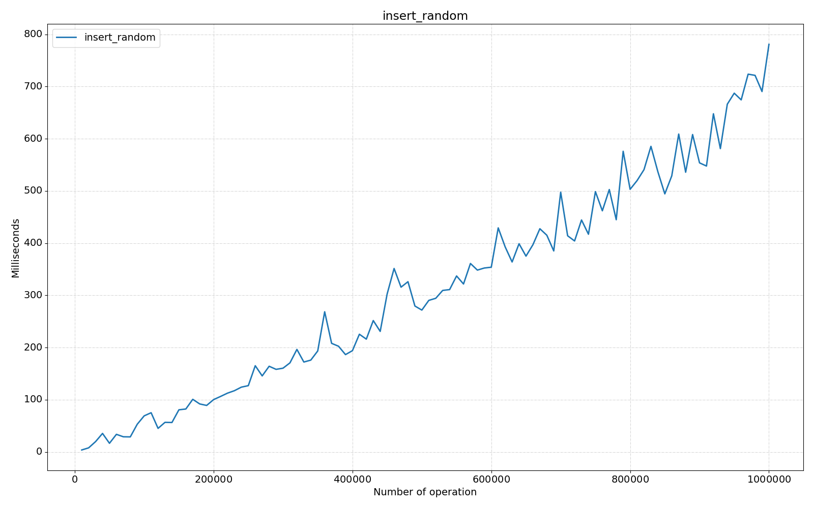
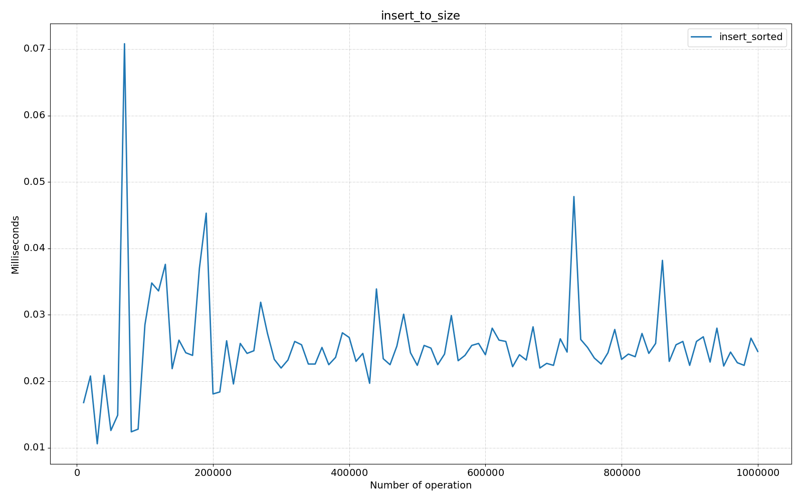
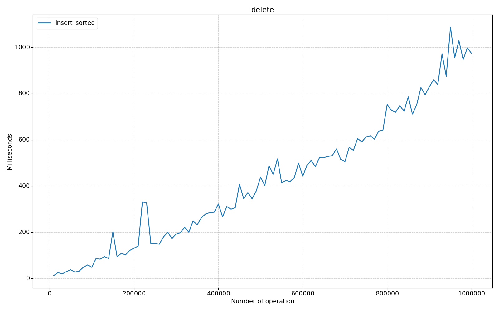
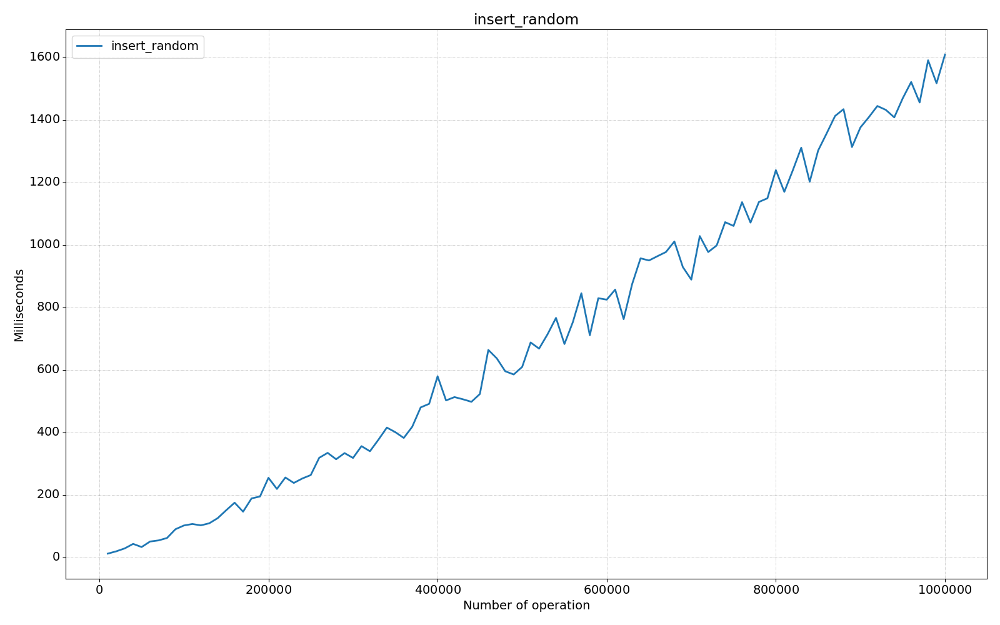

<style>
p, ul, li {
    font-size: 10pt;
    text-align: justify;
    line-height: 16pt;
}

td p {
    text-align: left;
}

pre {
    font-size: 8pt;
    margin: 0;
}

img {
    padding: 1pt;
}

hr {
    opacity: 0;
    page-break-after: always;
}
</style>

# Content

1. Introduction
2. Binary search tree
    1. Implementation
        1. `getMinimum()` / `getMaximum()`
        2. `getSuccessor()`
        3. Main methods
            1. `insert()`
            2. `search()`
            3. `delete()`
    2. Self-balancing binary search tree
        1. Implementation
            1. `rotateLeft()`
            2. `rotateRight()`
        2. AVL tree
            1. `rebalance()`
            2. Tests
        3. Splay tree
            1. `splay()`
            2. Tests
        4. Comparing summary
3. Hash table
    1. Hashing
    2. Open addressing
        1. Implementation
            1. `class Node`
            2. `getIndex()`
            3. `get()`
            4. `put()`
            5. `remove()`
            6. Tests
    3. Closed addressing
        1. Implementation
            1. `class Node`
            2. `getIndex()`
            3. `get()`
            4. `put()`
            5. `remove()`
            6. Tests
    4. Comparing summary

# Introduction

In this assignment we needed to implement two binary search trees and two hash table variations.

I chose to implement the AVL and Splay trees because they are the most common and popular. For hash tables, there are
only two: with open addressing and with closed addressing.

For the best testing I decided to move away from the idea of testing with `Date.now()`, because it's silly and can lead
to incorrect results. Therefore, I decided to use [`jmh-core`](https://github.com/openjdk/jmh), since I chose to use
Java.

> ⚠️ In my implementation I tested up to one million, because, with numbers higher than that - I got an
> error `java.lang.OutOfMemoryError: native memory extradition`. In addition, I think tests above this number are
> useless,
> because it's better to specify performance on a set of tests, not on how big those tests are.

> 

Intel(R) Core(TM) i7-10870H CPU @ 2.20GHz   2.21 GHz

---

# Binary search tree

A binary search tree (BST) is a rooted binary tree data structure with the key of each internal node being greater than
all the keys in the respective node’s left subtree and less than the ones in its right subtree. In other words, it is a
tree data structure where each node has at most two children, which are referred to as the left child and the right
child. The left subtree of a node contains only nodes with keys lesser than the node’s key while the right subtree of a
node contains only nodes with keys greater than the node’s key.

Binary search trees are used to quickly find a value in a large set of values. They are particularly useful for
searching through sorted data.

## Implementation

<table>
<tr>
<td>

`getMinimum()`

Finding element with the minimum value

</td>
<td style="padding: 0">

[//]: # (@f:off)
```java
protected Node getMinimum(Node node) {
    while (node.left != null) {
        node = node.left;
    }
    return node;
}
```
[//]: # (@f:on)

</td>
</tr>
<tr>
<td>

`getMaximum()`

Finding the element with the maximum value.

</td>
<td style="padding: 0">

[//]: # (@f:off)
```java
protected Node getMaximum(Node node) {
    while (node.right != null) {
        node = node.right;
    }
    return node;
}
```
[//]: # (@f:on)

</td>
</tr>
<tr>
<td>

`getSuccessor()`

Is used to find the node with the smallest key greater than a given value. It is also known as the inorder successor of
a node.

</td>
<td style="padding: 0">

[//]: # (@f:off)
```java
protected Node getSuccessor(Node node) {
    // if there is right branch, then successor 
    // is leftmost node of that
    // subtree
    if (node.right != null) {
        return getMinimum(node.right);
    } else { 
        // otherwise it is the lowest 
        // ancestor whose left child is also
        // ancestor of node
        Node currentNode = node;
        Node parentNode = node.parent;
        while (parentNode != null && currentNode == parentNode.right) {
            // go up until we find parent 
            // that currentNode is not in right
            // subtree.
            currentNode = parentNode;
            parentNode = parentNode.parent;
        }
        return parentNode;
    }
}
```
[//]: # (@f:on)

</td>
</tr>
</table>

### Main functions

<table>
<tr>
<td>

`insert()`

Is used to insert a new node into the binary search tree. The function takes a value as input and inserts it into the
correct position in the tree so that the binary search tree property is maintained.

</td>
<td style="padding: 0">

[//]: # (@f:off)
```java
public Node insert(int element) {
    if (root == null) {
        root = createNode(element, null, null, null);
        size++;
        return root;
    }

    Node insertParentNode = null;
    Node searchTempNode = root;
    while (searchTempNode != null && searchTempNode.value != null) {
        insertParentNode = searchTempNode;
        if (element < searchTempNode.value) {
            searchTempNode = searchTempNode.left;
        } else {
            searchTempNode = searchTempNode.right;
        }
    }

    Node newNode = createNode(element, insertParentNode, null, null);
    if (insertParentNode.value > newNode.value) {
        insertParentNode.left = newNode;
    } else {
        insertParentNode.right = newNode;
    }

    size++;
    return newNode;
}
```
[//]: # (@f:on)

</td>
<tr>
<td>

`delete()`

Is used to delete a node from the binary search tree. The function takes a value as input and deletes the node with that
value from the tree while maintaining the binary search tree property.

</td>
<td style="padding: 0">

[//]: # (@f:off)
```java
protected Node delete(Node deleteNode) {
    if (deleteNode != null) {
        Node nodeToReturn = null;
        if (deleteNode != null) {
            if (deleteNode.left == null) {
                nodeToReturn = transplant(deleteNode, deleteNode.right);
            } else if (deleteNode.right == null) {
                nodeToReturn = transplant(deleteNode, deleteNode.left);
            } else {
                Node successorNode = getMinimum(deleteNode.right);
                if (successorNode.parent != deleteNode) {
                    transplant(successorNode, successorNode.right);
                    successorNode.right = deleteNode.right;
                    successorNode.right.parent = successorNode;
                }
                transplant(deleteNode, successorNode);
                successorNode.left = deleteNode.left;
                successorNode.left.parent = successorNode;
                nodeToReturn = successorNode;
            }
            size--;
        }

        return nodeToReturn;
    }
    return null;
}
```
[//]: # (@f:on)

</td>
</tr>
</table>
<table>
<tr>
<td>


`search()`

Is used to search for a node with a given value in the binary search tree. The function takes a value as input and
returns the node with that value if it exists in the tree, otherwise it returns null.

</td>
<td style="padding: 0">

[//]: # (@f:off)
```java
public Node search(int element) {
    Node node = root;
    while (node != null && node.value != null && node.value != element) {
        if (element < node.value) {
            node = node.left;
        } else {
            node = node.right;
        }
    }
    return node;
}
```
[//]: # (@f:on)

</td>
</tr>
</table>

---

# Self-balancing binary search tree

A self-balancing binary search tree is a binary search tree that automatically tries to keep its height as minimal as
possible at all times (even after performing operations such as insertions or deletions). This is achieved by performing
rotations on the tree when necessary to balance it out.

## Implementation

In an AVL tree, a node is balanced if the height of its left subtree and right subtree differ by at most 1. If a node
becomes unbalanced, a rotation is performed to balance it out. The rotateLeft function is used to balance a right-heavy
node while the rotateRight function is used to balance a left-heavy node.

The rotateLeft and rotateRight functions are used to balance the tree when it becomes unbalanced. These functions are
used in self-balancing binary search trees such as AVL trees, Red-Black trees, and Splay trees.


<table>
<tr>
<td>

`rotateLeft()`

</td>
<td style="padding: 0">

[//]: # (@f:off)
```java
protected Node rotateLeft(Node node) {
    Node temp = node.right;
    temp.parent = node.parent;

    node.right = temp.left;
    if (node.right != null) {
        node.right.parent = node;
    }

    temp.left = node;
    node.parent = temp;

    // temp took over node's place so now its parent should point to temp
    if (temp.parent != null) {
        if (node == temp.parent.left) {
            temp.parent.left = temp;
        } else {
            temp.parent.right = temp;
        }
    } else {
        root = temp;
    }

    return temp;
}
```
[//]: # (@f:on)

</td>
</tr>
<tr>
<td>

`rotateRight`

</td>
<td style="padding: 0">

[//]: # (@f:off)
```java
protected Node rotateRight(Node node) {
    Node temp = node.left;
    temp.parent = node.parent;

    node.left = temp.right;
    if (node.left != null) {
        node.left.parent = node;
    }

    temp.right = node;
    node.parent = temp;

    // temp took over node's place so now its parent should point to temp
    if (temp.parent != null) {
        if (node == temp.parent.left) {
            temp.parent.left = temp;
        } else {
            temp.parent.right = temp;
        }
    } else {
        root = temp;
    }

    return temp;
}
```
[//]: # (@f:on)

</td>
</tr>
</table>

---

# AVL tree

AVL tree is a self-balancing binary search tree where the difference between the heights of the left and right subtrees
of any node is at most 1. This ensures that the height of the tree is always O(log n) where n is the number of nodes in
the tree.

## Implementation

In an AVL tree, when a node is inserted or deleted, there is a chance that the tree becomes unbalanced. In order to
rebalance the tree again to satisfy the height criteria, AVL tree rotations are performed.

When a node is inserted into an AVL tree, the balance factor of its nodes is checked. If the balance factor of a node is
greater than one or less than -1, the tree re-balances itself 2. There are two operations to rebalance a tree:
rotateLeft and rotateRight.

<table>
<tr>
<td>

`rebalance()`

</td>
<td style="padding: 0">

[//]: # (@f:off)
```java
private void rebalance(AVLNode node) {
    while (node != null) {

        Node parent = node.parent;

        int leftHeight = (node.left == null) ? -1 : ((AVLNode) node.left).height;
        int rightHeight = (node.right == null) ? -1 : ((AVLNode) node.right).height;
        int nodeBalance = rightHeight - leftHeight;
        // rebalance (-2 means left subtree outgrow, 2 means right subtree)
        if (nodeBalance == 2) {
            if (node.right.right != null) {
                node = (AVLNode) avlRotateLeft(node);
                break;
            } else {
                node = (AVLNode) doubleRotateRightLeft(node);
                break;
            }
        } else if (nodeBalance == -2) {
            if (node.left.left != null) {
                node = (AVLNode) avlRotateRight(node);
                break;
            } else {
                node = (AVLNode) doubleRotateLeftRight(node);
                break;
            }
        } else {
            updateHeight(node);
        }

        node = (AVLNode) parent;
    }
}
```
[//]: # (@f:on)

</td>
</tr>
</table>

---
## Tests

### `insert_random()`

Add `size` elements, randomly from 0 to `size`. With use `Java` class `Random` for this.

<table>
<tr>
<td style="padding: 0">

[//]: # (@f:off)
```java
public void insertRandomSetUp() {
    insertRandomTree = new AVLTree();
}

@Benchmark
public void insert_random() {
    for (int i = 0; i < size; i++) {
        insertRandomTree.insert(random.nextInt(size));
    }
}
```
[//]: # (@f:on)

</td>
<td style="padding: 0">

```csv
"Score","Errors","Unit","Size"
1.959343,NaN,"ms/op",5000
6.726748,NaN,"ms/op",10000
22.905303,NaN,"ms/op",15000
11.968063,NaN,"ms/op",20000
20.976361,NaN,"ms/op",25000
28.630229,NaN,"ms/op",30000
14.519820,NaN,"ms/op",35000
```

</td>
</tr>
<tr>
<td style="padding: 0" colspan="2">



</td>
</tr>
</table>

---
### `insert_sorted()`

Add `size` elements, from 0 to `size`.

<table>
<tr>
<td style="padding: 0">

[//]: # (@f:off)
```java
public void insertSortedSetUp() {
    insertSortedTree = new AVLTree();
}

@Benchmark
public void insert_sorted() {
    for (int i = 0; i < size; i++) {
        insertSortedTree.insert(i);
    }
}
```
[//]: # (@f:on)

</td>
<td style="padding: 0">

```csv
"Score","Errors","Unit","Size"
1.518733,NaN,"ms/op",5000
3.449975,NaN,"ms/op",10000
7.603064,NaN,"ms/op",15000
6.575142,NaN,"ms/op",20000
5.917528,NaN,"ms/op",25000
...
```

</td>
</tr>
<tr>
<td style="padding: 0" colspan="2">


</td>
</tr>
</table>

---
### `insert_to_size()`

Adding one element to an already populated `size` with random 0 to `size` elements.

<table>
<tr>
<td style="padding: 0">

[//]: # (@f:off)
```java
public void insertToSizeSetUp() {
    insertToSizeTree = new AVLTree();
    for (int i = 0; i < size; i++) {
        insertToSizeTree.insert(random.nextInt(size));
    }
}

@Benchmark
public void insert_to_size() {
    insertSortedTree.insert(random.nextInt(size + 1));
}
```
[//]: # (@f:on)

</td>
<td style="padding: 0">

```csv
"Score","Errors","Unit","Size"
0.057601,NaN,"ms/op",5000
0.049901,NaN,"ms/op",10000
0.027200,NaN,"ms/op",15000
0.016400,NaN,"ms/op",20000
0.026101,NaN,"ms/op",25000
0.017800,NaN,"ms/op",30000
...
```

</td>
</tr>
<tr>
<td style="padding: 0" colspan="2">



</td>
</tr>
</table>

---
### `delete()`

Randomly delete `size` elements in an already populated tree with random numbers from 0 to `size`.

<table>
<tr>
<td style="padding: 0">

[//]: # (@f:off)
```java
public void deleteSetUp() {
    deleteTree = new AVLTree();
    deletedValues = new Integer[size];
    for (int i = 0; i < size; i++) {
        int number = random.nextInt(size);
        deleteTree.insert(number);
        deletedValues[i] = number;
    }
}

@Benchmark
public void delete() {
    for (int i = 0; i < size; i++) {
        deleteTree.delete(deletedValues[i]);
    }
}
```
[//]: # (@f:on)

</td>
<td style="padding: 0">

```csv
"Score","Errors","Unit","Size"
7.452162,NaN,"ms/op",5000
11.379446,NaN,"ms/op",10000
13.703797,NaN,"ms/op",15000
17.677583,NaN,"ms/op",20000
16.901867,NaN,"ms/op",25000
43.977155,NaN,"ms/op",30000
...
```

</td>
</tr>
<tr>
<td style="padding: 0" colspan="2">



</td>
</tr>
</table>

---
### `search()`

Search for an element that has inserted into tree by random value from 0 to `size`.

<table>
<tr>
<td style="padding: 0">

[//]: # (@f:off)
```java
public void searchSetUp() {
    searchTree = new AVLTree();
    searchedValues = new Integer[size];
    for (int i = 0; i < size; i++) {
        int number = random.nextInt(size);
        searchTree.insert(number);
        searchedValues[i] = number;
    }
}

@Benchmark
public void search() {
    for (int i = 0; i < size; i++) {
        insertSortedTree.search(searchedValues[i]);
    }
}
```
[//]: # (@f:on)

</td>
<td style="padding: 0">

```csv
"Score","Errors","Unit","Size"
0.497411,NaN,"ms/op",5000
0.755216,NaN,"ms/op",10000
1.300928,NaN,"ms/op",15000
2.138446,NaN,"ms/op",20000
1.572134,NaN,"ms/op",25000
2.450953,NaN,"ms/op",30000
...
```

</td>
</tr>
<tr>
<td style="padding: 0" colspan="2">


</td>
</tr>
</table>

---
### Conclusion


---
# Splay tree

Splay tree is a self-adjusting binary search tree where recently accessed elements are placed at the root of the tree.
In a splay tree, every operation is performed at the root of the tree. All the operations in splay tree are involved
with a common operation called “Splaying”.

Splay trees are not strictly balanced trees, but they are roughly balanced trees 3. In a splay tree, M consecutive
operations can be performed in O (M log N) time. A single operation may require O (N) time but average time to perform M
operations will need O (M Log N) time.

## Implementation

Splaying is the basic operation for the splay trees which rearranges the tree so that element is placed at the root of
the tree. The nodes of the tree are moved closer to the root so that they can be accessed quickly. In a splay tree,
every operation is performed at the root of the tree. All operations in the splay tree involve one common operation
called splaying.

The splay tree moves a node x to the root of the tree by performing series of single and double tree rotations. Each
double rotation moves x to its grandparent’s place and every single rotation moves x to its parent’s place. We perform
these rotations until x reaches to the root of the tree.

<table>
<tr>
<td>

`splay()`

</td>
<td style="padding: 0">

[//]: # (@f:off)
```java
protected void splay(Node node) {
    // move node up until its root
    while (node != root) {
        // Zig step
        Node parent = node.parent;
        if (parent.equals(root)) {
            if (node.equals(parent.left)) {
                rotateRight(parent);
            } else if (node.equals(parent.right)) {
                rotateLeft(parent);
            }
            break;
        } else {
            Node grandParent = parent.parent;
            boolean nodeAndParentLeftChildren 
                    = node.equals(parent.left) && parent.equals(grandParent.left);
            boolean nodeAndParentRightChildren 
                    = node.equals(parent.right) && parent.equals(grandParent.right);
            boolean nodeRightChildParentLeftChild 
                    = node.equals(parent.right) && parent.equals(grandParent.left);
            boolean nodeLeftChildParentRightChild 
                    = node.equals(parent.left) && parent.equals(grandParent.right);
            // Zig zig step to the right
            if (nodeAndParentLeftChildren) {
                rotateRight(grandParent);
                rotateRight(parent);
            }
            // Zig zig step to the left
            else if (nodeAndParentRightChildren) {
                rotateLeft(grandParent);
                rotateLeft(parent);
            }
            // Zig zag steps
            else if (nodeRightChildParentLeftChild) {
                rotateLeft(parent);
                rotateRight(grandParent);
            } else if (nodeLeftChildParentRightChild) {
                rotateRight(parent);
                rotateLeft(grandParent);
            }
        }
    }
}
```
[//]: # (@f:on)

</td>
</tr>
</table>

---

## Tests

### `insert_random()`

Add `size` elements, randomly from 0 to `size`. With use `Java` class `Random` for this.

<table>
<tr>
<td style="padding: 0">

[//]: # (@f:off)
```java
public void insertRandomSetUp() {
    insertRandomTree = new SplayTree();
}

@Benchmark
public void insert_random() {
    for (int i = 0; i < size; i++) {
        insertRandomTree.insert(random.nextInt(size));
    }
}
```
[//]: # (@f:on)

</td>
<td style="padding: 0">

```csv
"Score","Errors","Unit","Size"
15.965544,NaN,"ms/op",5000
9.120197,NaN,"ms/op",10000
14.361310,NaN,"ms/op",15000
40.180367,NaN,"ms/op",20000
37.791215,NaN,"ms/op",25000
73.940296,NaN,"ms/op",30000
```

</td>
</tr>
<tr>
<td style="padding: 0" colspan="2">



</td>
</tr>
</table>

---

### `insert_sorted()`

Add `size` elements, from 0 to `size`.

<table>
<tr>
<td style="padding: 0">

[//]: # (@f:off)
```java
public void insertSortedSetUp() {
    insertSortedTree = new SplayTree();
}

@Benchmark
public void insert_sorted() {
    for (int i = 0; i < size; i++) {
        insertSortedTree.insert(i);
    }
}
```
[//]: # (@f:on)

</td>
<td style="padding: 0">

```csv
"Score","Errors","Unit","Size"
1.939042,NaN,"ms/op",5000
1.408531,NaN,"ms/op",10000
2.098846,NaN,"ms/op",15000
5.610523,NaN,"ms/op",20000
2.563656,NaN,"ms/op",25000
54.161887,NaN,"ms/op",30000
...
```

</td>
</tr>
<tr>
<td style="padding: 0" colspan="2">


</td>
</tr>
</table>

---

### `insert_to_size()`

Adding one element to an already populated `size` with random 0 to `size` elements.

<table>
<tr>
<td style="padding: 0">

[//]: # (@f:off)
```java
public void insertToSizeSetUp() {
    insertToSizeTree = new SplayTree();
    for (int i = 0; i < size; i++) {
        insertToSizeTree.insert(random.nextInt(size));
    }
}

@Benchmark
public void insert_to_size() {
    insertSortedTree.insert(random.nextInt(size + 1));
}
```
[//]: # (@f:on)

</td>
<td style="padding: 0">

```csv
"Score","Errors","Unit","Size"
0.013100,NaN,"ms/op",5000
0.018701,NaN,"ms/op",10000
0.033401,NaN,"ms/op",15000
0.020000,NaN,"ms/op",20000
0.021800,NaN,"ms/op",25000
0.015700,NaN,"ms/op",30000
...
```

</td>
</tr>
<tr>
<td style="padding: 0" colspan="2">


</td>
</tr>
</table>

---

### `delete()`

Randomly delete `size` elements in an already populated tree with random numbers from 0 to `size`.

<table>
<tr>
<td style="padding: 0">

[//]: # (@f:off)
```java
public void deleteSetUp() {
    deleteTree = new SplayTree();
    deletedValues = new Integer[size];
    for (int i = 0; i < size; i++) {
        int number = random.nextInt(size);
        deleteTree.insert(number);
        deletedValues[i] = number;
    }
}

@Benchmark
public void delete() {
    for (int i = 0; i < size; i++) {
        deleteTree.delete(deletedValues[i]);
    }
}
```
[//]: # (@f:on)

</td>
<td style="padding: 0">

```csv
"Score","Errors","Unit","Size"
8.420483,NaN,"ms/op",5000
12.132464,NaN,"ms/op",10000
19.173316,NaN,"ms/op",15000
30.262857,NaN,"ms/op",20000
53.679865,NaN,"ms/op",25000
71.375149,NaN,"ms/op",30000
...
```

</td>
</tr>
<tr>
<td style="padding: 0" colspan="2">


</td>
</tr>
</table>

---

### `search()`

Search for an element that has inserted into tree by random value from 0 to `size`.

<table>
<tr>
<td style="padding: 0">

[//]: # (@f:off)
```java
public void searchSetUp() {
    searchTree = new SplayTree();
    searchedValues = new Integer[size];
    for (int i = 0; i < size; i++) {
        int number = random.nextInt(size);
        searchTree.insert(number);
        searchedValues[i] = number;
    }
}

@Benchmark
public void search() {
    for (int i = 0; i < size; i++) {
        insertSortedTree.search(searchedValues[i]);
    }
}
```
[//]: # (@f:on)

</td>
<td style="padding: 0">

```csv
"Score","Errors","Unit","Size"
12.132563,NaN,"ms/op",5000
17.020268,NaN,"ms/op",10000
38.226627,NaN,"ms/op",15000
38.704237,NaN,"ms/op",20000
44.073553,NaN,"ms/op",25000
110.826296,NaN,"ms/op",30000
...
```

</td>
</tr>
<tr>
<td style="padding: 0" colspan="2">


</td>
</tr>
</table>


